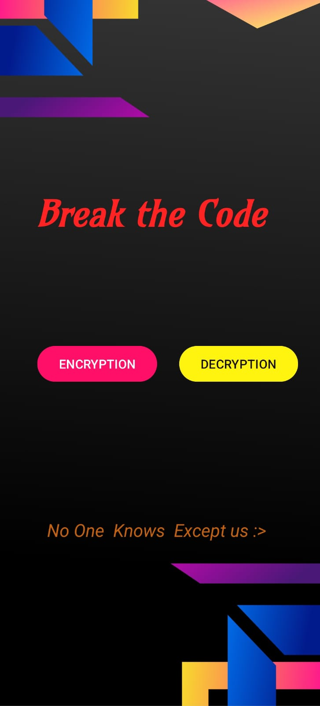

# 🔐 CodeBreaker – Android Encryption App

CodeBreaker is a lightweight Android application built to help users securely **encrypt** and **decrypt** text using simple logic-based algorithms. It provides a beginner-friendly way to understand how basic encryption works through a clean, intuitive interface.

---

## 📱 Features

- 🔒 Text encryption using custom logic  
- 🔓 Decryption of previously encrypted messages  
- 💡 Simple, responsive UI  
- 🧠 Educational use of encryption concepts  
- ☕ Built in Java using Android Studio  

---

## 🧪 How It Works

1. Enter a message in the **ENCRYPTION** screen  
2. Tap the **Encrypt** button to generate an encoded message  
3. Share or store the result  
4. Paste it in the **DECRYPTION** screen to decode it back  

---

## 🔽 Download

Click the link below to download the `.apk`:  
[](https://drive.google.com/file/d/1z9O32yA-9sKYscAzat9vfmNUG83VvXMT/view?usp=drive_link)

---

## 📷 Screenshots

    
    
    

---

## 🛠 Tech Stack

- **Language**: Java  
- **IDE**: Android Studio  
- **UI**: XML + ConstraintLayout  
- **Min SDK**: 21 (Lollipop)  

---

## ⚠️ Disclaimer

This app uses a **basic algorithm** for demonstration purposes only.  
It is **not** suitable for securing sensitive or real-world data.

For secure encryption, consider libraries like:
- `javax.crypto` (AES, DES)
- `Bouncy Castle`
- `Tink by Google`

---

## 📁 Installation

```bash
git clone https://github.com/hussainwaseer/CodeBreaker.git
- Open in Android Studio
- Go to Build > Build Bundle(s) / APK(s) > Build APK
- Install the APK on your Android device

---
## 🧠 Credits
Developed by Hussain Waseer
For learning and demonstration purposes.

## 📄 License
This project is open-source and free to use under the MIT License.
